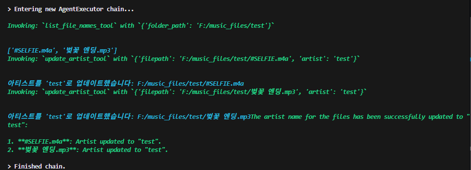

내 첫 번째 포스트.

## 생활에서 발견한 문제
난 iTunes를 이용해서 다운로드한 음원들을 정리하고 있는데, 다운로드 할 때마다 태그가 제 각 각이다. 음악 어플에서 음악 찾기가 너무 번거롭고 귀찮았다. 최근에 Langchain을 배우기 시작했기 때문에 배움의 일환으로 Langchain을 이용해 AI agent를 개발해 볼 생각을 했다.

## Langchain tool 사용
Langchain에서는 `@tool` 데코레이터를 이용해 다음과 같이 사용할 파이썬 코드를 함수를 이용해서 지정해줄 수 있다. 

함수 정의 밑에 docstring을 이용해서 description을 작성하는 것을 잊지말아야 한다. 

예시:
```python
@tool
def list_file_names_tool(folder_path: str) -> str:
    """List file names in selected folder
    Args:
        folder_path (str): folder path
    """
    return list_file_names(folder_path)

@tool
def update_title_tool(filepath: str, title: str) -> str:
    """Update the title of the given audio file.
    Args: filepath:filepath, title:title
    """
    return update_title(filepath, title)
```

짧은 코드만 작성했지만 이렇게 기초적인 기능은 잘 작동하였다. 



성공적으로 폴더 내의 파일을 읽고, AI agent가 아티스트의 tag정보를 편집하였다.

## 미래에 고려할 요소
 - 수 천개 ~ 수 만개, 수 십만개의 음원 파일을 전부 읽어 편집할 수 있도록 만들어야 한다. 파일을 접근할 때 RAG를 이용하여 빨리 접근할 수 있도록 만들 예정이다.
 - python code execution 기능은 강력하지만 AI agent가 한 번 실행하면 되돌리지 못한다. 작업 전에 음원 파일들을 강력히 권장해야한다. 
---

## 정리 
음악 태그를 한꺼번에 편집해주는 AI agent를 개발하고 있는데 아직 실험 중이다.


## 참고
https://python.langchain.com/docs/how_to/functions/
