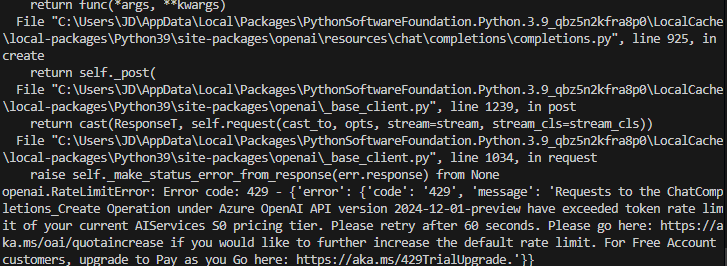

## 문제 인식
---
수 천개의 음원 파일을 가져올 때, 음원 파일이 너무 많아 token limit 제한에 걸려 에러가 나온다. 



-> token limit에 도달함.

## 문제 해결 방안
---
-> RAG를 이용함<br>
**Indexing**
RAG를 이용하여 음원파일의 tag 정보를 가져오고, 텍스트를 분할하고, 임베딩하여, 벡터 데이터베이스에 저장한다. 이것이 Indexing 과정이다. 이를 통해 input token의 개수를 줄이고, 수천 개의 오디오 파일의 메타데이터를 효율적으로 가져와 성능을 향상시킨다.

.png)

예시 데이터들은 다음과 같다. 
```text
filename: song1.mp3, title: Love Story, artist: Taylor Swift, genre: Country, year: 2008, track: 1, comment: Classic hit, albumartist: Taylor Swift, composer: Taylor Swift \n\n
filename: song2.mp3, title: Blank Space, artist: Taylor Swift, genre: Pop, year: 2014, track: 2, comment: Billboard no.1, albumartist: Taylor Swift, composer: Max Martin \n\n
filename: song3.mp3, title: Bohemian Rhapsody, artist: Queen, genre: Rock, year: 1975, track: 1, comment: Legendary song, albumartist: Queen, composer: Freddie Mercury \n\n
...
```
<br>

1. **텍스트 분할** - 파일이름과 메타 데이터들을 같이 1 chunk로 나눌 예정이다. 의미 단위(=각 음악 파일 하나)로 나누어 저장한다.

    이렇게 되면 임베딩 처리 시 의미 단위로 나뉘게 된다. (곡 하나 = 하나의 벡터)
    eg.
    ```text
    filename: song1.mp3, title: Love Story, artist: Taylor Swift, genre: Country, year: 2008, track: 1, comment: Classic hit, albumartist: Taylor Swift, composer: Taylor Swift -> 1 chunk
    filename: song2.mp3, title: Blank Space, artist: Taylor Swift, genre: Pop, year: 2014, track: 2, comment: Billboard no.1, albumartist: Taylor Swift, composer: Max Martin -> 1 chunk
    filename: song3.mp3, title: Bohemian Rhapsody, artist: Queen, genre: Rock, year: 1975, track: 1, comment: Legendary song, albumartist: Queen, composer: Freddie Mercury -> 1 chunk
    ```

    하나의 chunk가 의미 단위가 완결된 structured text가 된다. 여기서 langchain에서 제공하는 텍스트 분할을 더 하지않고, 임베딩을 진행할 예정이다.  
    <br>
2. **임베딩** - 분할된 chunk를 기계가 이해할 수 있는 수치적 형태(벡터)로 변환하는 과정이다. 이 과정은 벡터 검색을 용이하게 만드는 것인데, 전체 데이터를 LLM에 넘기는 것보다 벡터 검색을 이용해서 필요한 내용만 벡터형태로 LLM으로 넘기면, LLM이 참조할 텍스트가 줄어들며 토큰을 확실하게 줄일 수 있다. 이것이 **벡터 검색** (vector search) 이다. 의미 기반 검색은 두 텍스트 벡터 사이의 거리를 계산하여, 텍스트 간의 유사성 정도를 정량적으로 평가 한다. <br><br>

3. **데이터베이스에 적재** - 변환된 벡터들은 벡터 데이터베이스에 저장되며, 이를 통해 검색의 효율성을 높인다. 


## 미래에 고려할 요소
---

 - Retrieve하는 방법이 다양하게 존재해서, 어떤 방법을 선택할지 고민해야한다. 
 - 만약에 음원의 정보를 업데이트한다면, 또 다음 챗의 응답을 위해 음원의 바뀐 정보를 벡터 데이터베이스에 적재해야하는데, 선택적으로 이 정보를 데이터베이스에 저장할 수 있는지 고안해야 한다. 

 ## 정리
 ---
 RAG를 이용하여 음원 정보에 접근하고 인덱싱함.


