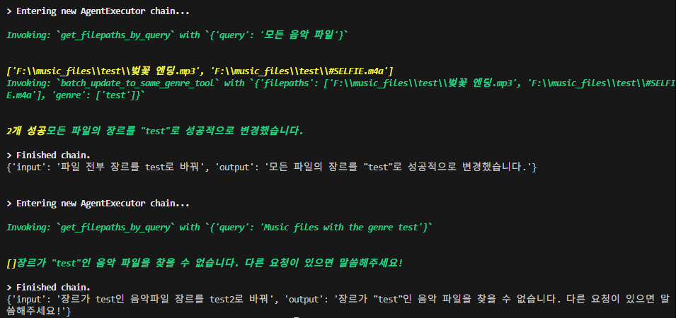
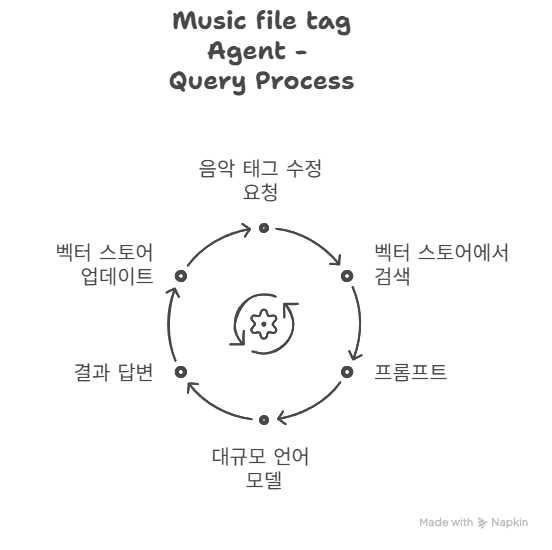
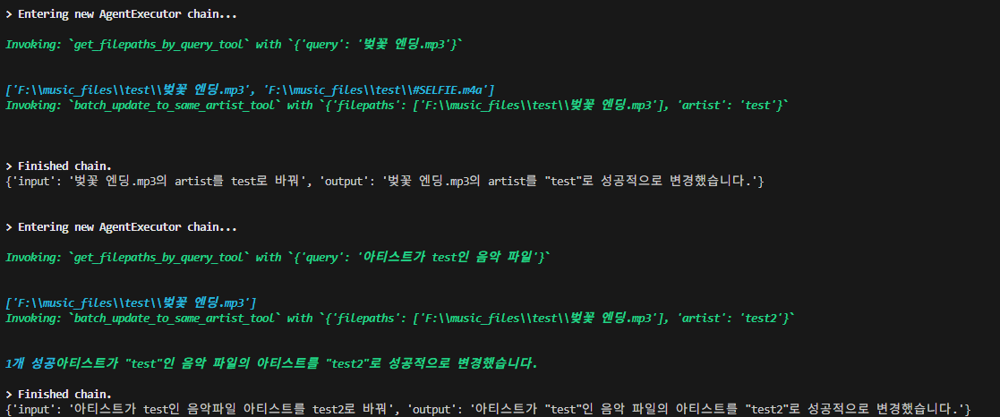

### 문제 인식
---
어떤 파일의 태그정보를 a로 바꾸고 그 다음 프롬프트에서 태그정보가 a인 것을 b로 바꿔달라고 하면



### 해결방안
---

우리가 현재 사용하는 AI agent들은 대체로 multi-turn conversation을 지원한다. 예를 들어:
```
User: 이순신이 누구야?
AI: 조선시대의 장군으로, 임진왜란 당시 활약했어요.

User: 그 사람이 한산도 대첩에서 한 일은?
AI: 한산도 대첩에서 학익진 전술을 사용해 일본 수군을 크게 무찔렀어요.
```

과거의 대화를 그 다음 대화에서 반영, 과거의 대화를 다음 대화의 정보로 활용한다. 내가 지금 만드려는 음악 태그 편집 에이전트는 과거의 대화에서 어떤 메타데이터를 업데이트했다면, 그 변경 후의 정보를 다음 대화에 적용해야한다. RAG에서는 메타데이터를 변경할 때 마다 vector store를 불러와 업데이트 해주면 된다. 
<br>





python으로 개발하면서 파일을 따로 나눴기에, 이 vector store를 getter함수로 감싸서 태그 정보를 수정할 때 마다 vector store를 불러와 업데이트해서 문제를 해결하였다. 그리고 document_id는 고유한 것이므로 {filepath}로 지정하였다. 윈도우에서는 폴더 내에 파일명이 같은 것은 존재할 수가 없다. 

```python
# langchain - ChromaDB 사용
vector_store = get_vector_store()
vector_store.update_document(
    document=Document(page_content="page_content", metadata={"artist": artist})
    ,document_id=f"{filepath}")
```
<br>
그리고 테스트해보았다.



--> 성공
