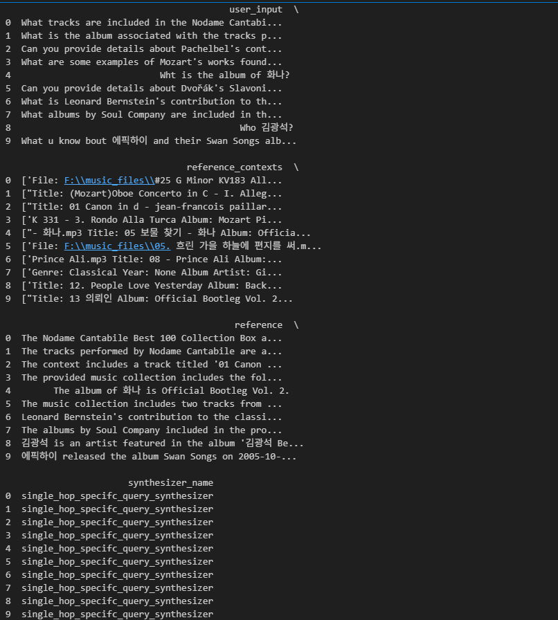
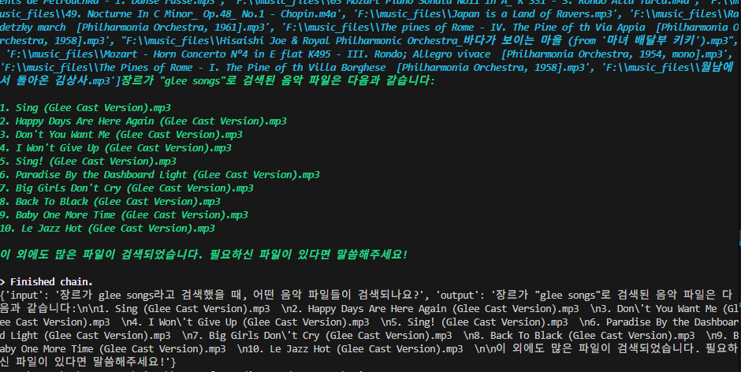
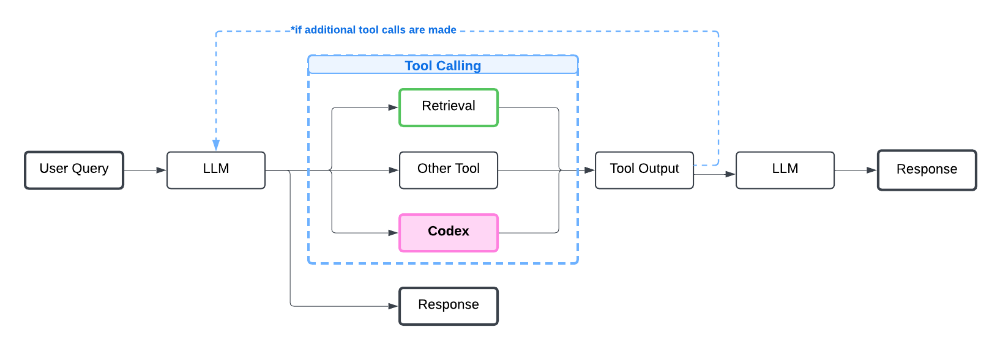

### RAG pipeline 평가
---

에이전트를 어느정도 만들었다면, 에이전트가 곡의 정보를 잘 가져오는지 평가를 해야한다.

평가를 하기위해서는, 테스트 데이터셋(질문-정답 쌍)이 필요하다. 그래서 RAGAS를 이용하여 합성(인공) 데이터셋을 만들었다. 이 데이터셋은 RAG pipeline을 위한 데이터셋이다. 내가 가진 원본 문서(Documents)들을 기반으로 RAG 시스템을 테스트하는 데 필요한 질문(question), 정답(ground_truth), 그리고 관련 문맥(contexts) 세트를 자동으로 만들어주는 기능이다. 


-> Testset Generation 결과의 예, 약 200개 정도의 데이터셋을 생성하였다.

single hop specific query 67개와 multi hop abstract query 67개, 나머지는 multi hop specific query로 구성되었다. 

평가지표는 BLEU, ROUGE score이다. RAGAS 라이브러리를 이용해 구현하였다. 두 스코어 모두 traditional한 방법에 속한다. 

BLEU score: n-그램 중복률을 계산하여 점수를 매기는 방법이다. 다시말하면, 예측 문장의 n-그램 중에서 참조 문장에도 등장하는 비율을 계산하는 방법이다. 내가 출력한 것 중에서 얼마나 많이 정답이었는가?를 평가한다. 
ROUGE socre: 특히 텍스트 요약 평가에 많이 쓰이지만, 요즘은 LLM이 생성한 답변의 질을 평가할 때도 자주 사용한다. 기계가 생성한 텍스트와 참조(사람)이 작성한 정답 텍스트 간의 유사도를 측정하는데, 이 방법도 n-그램을 이용하여 n-그램 단위로 정답과 얼마나 많이 겹치는지를 측정한다. BLEU와 달리 모델이 예측한 것 중 얼마나 정답이었는가?를 평가한다. 

```python
async def compute_scores():
    for idx, row in df.iterrows():
        user_input = row["user_input"]
        reference = row["reference"]

        try:
            result = agent_executor.invoke({"input": user_input})
            model_output = result.get("output", "")
        except Exception as e:
            print(f"에러 at index {idx}: {e}")
            model_output = ""

        model_responses.append(model_output)
        print(model_output)
        
        sample = SingleTurnSample(
            response=model_output,
            reference=reference
        )

        bleu_score = await bleu.single_turn_ascore(sample)
        rouge_score = await rouge.single_turn_ascore(sample)

        bleu_scores.append(bleu_score)
        rouge_scores.append(rouge_score) 
```


### 문제인식
---

BLEU score와 ROUGE score가 형편없이 나왔다. 각 각 score의 범위는 0.0 ~ 1.0 이다.

```text
BLEU Score 평균: 0.1555
ROUGE Score 평균: 0.2212
```

하지만 그에 반해, 파일명 변경은 성공적이었다. 


아직 RAGAS에서 tool calling에 대한 합성 데이터 생성은 지원하지 않아, 여러 개의 합성데이터로 테스트는 못해보았다. 


### 문제 생각해보기
---

RAGAS를 이용하여 합성데이터셋을 생성하면 input prompt와 reference가 생성되는데, input prompt의 예는 다음과 같다. 

```text
앨범 명이 노다메 칸다빌레 100 best에 해당하는 트랙들을 찾으시오
아티스트 명이 Mozart에 해당하는 트랙들의 앨범명은?
```

하지만 LLM의 응답으로는, 트랙들의 정보가 몇 개밖에 출력되지 않는데, 대량의 파일명 변경은 가능했다.. 왜 그럴까?






LLM은 tool calling을 판단하고, LLM이 도구 호출이 필요하다고 판단하면, retriever나 other tool을 사용한다. 그리고 tool output은 다시 LLM으로 전달되고, LLM은 요약된 응답만 출력한다. 여기서, 일부 대표 파일 이름만 언급할 수 있다.

그림의 맨 오른쪽에 있는 Response까지 다다르려면 그 전에, tool output을 응답을 받은 LLM을 반드시 거쳐야한다. LLM은 출력 제한이 있고, 애초에 훈련 과정에서 요약 중심의 응답 생성을 선호하도록 학습되어있어 response는 항상 음악파일 몇 개의 결과만 포함했던 것이다. 

### 정리
---

RAGAS 합성 데이터셋을 이용하여 평가했지만, 결과는 좋지않았다. 하지만 몇 개의 테스트를 해봤는데, tool calling 결과는 나쁘지않았다. 그 이유는 내부적인 구조때문에 그랬었다. 하지만 BLEU와 ROUGE score는 RAG시스템을 평가하기위한 척도로 알맞기에, RAG시스템을 고도화시킴에 따라 스코어가 상승한다면 긍정적인 영향으로 봐도 될 것이다. (하지만, 내 에이전트의 경우는 여러 정보 중 몇 개밖에 가져오지 않았기 때문에 스코어와 큰 관계가 없다고 생각했다.)

### 참고
---

https://docs.ragas.io/en/stable/getstarted/rag_testset_generation/
https://docs.ragas.io/en/stable/concepts/metrics/available_metrics/traditional/
https://help.cleanlab.ai/codex/tutorials/langchain/langchain_ToolCalls/


<!-- 약술형으로 쓰기, 내 생각도 같이 쓰기(정보 뒤에 내 생각 쓰기) 어떤게 좋았고 어떤게 안 좋았는지 쓰기-->